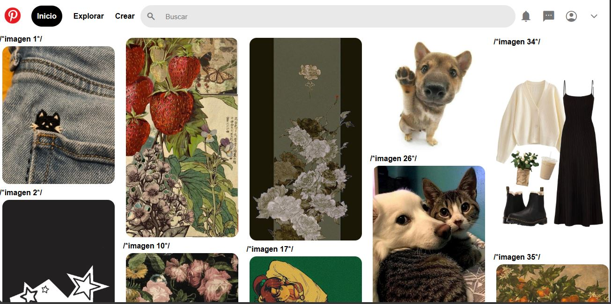

# Pinterest-Clone
## Proyecto responsivo realizado con Html y CSS

Proyecto creado durando el *bootcamp* de _Tecnolochicas Pro_ y es adaptable a distintos dispositivos o tamaños de pantalla.
El propósito de esta página web es __mostrar una replica visual de la pantalla de inicio de la aplicación de Pinterest__.💛

Aquí podrás acceder al proyecto [Pinterest-clone](https://github.com/stephanyvlz/pinterest-clone)

### Tecnologías utilizadas:

* HTML
* CSS
* * Bootstrap
* * JS

* * Este proyecto tiene una pequeña adición donde es posible ver una pestaña dentro de la flecha hacia abajo en la parte de la esquina derecha superior de la pantalla, contando así con la opcion de cambiar de tema a oscuro gracias a un poco de JavaScript.

## Captura del proyecto
